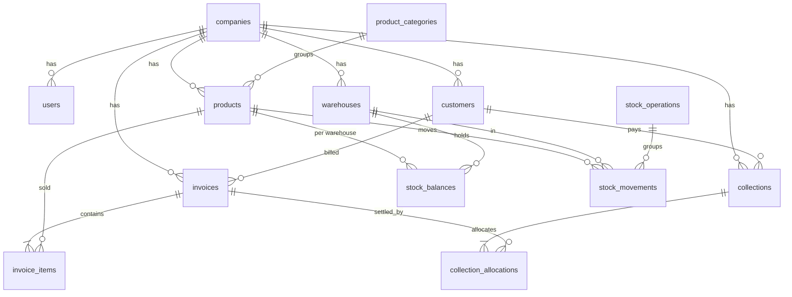

# ARCHITECTURE.md — Tawzee AI

> **الغرض:** *كيف* نبني النظام. المتطلبات وقواعد الأعمال في [PROJECT.md](PROJECT.md)، والمهام في [TASKS.md](TASKS.md). هذا الملف هو **المرجع الوحيد** للقرارات التقنية؛ لا تُكرَّر تفاصيله في ملفات أخرى.

---

## 1. المعمارية وسبب اختيارها

**Modular Monolith + Pragmatic Clean Architecture** على Laravel.

- **تطبيق واحد ونشر واحد:** فريق صغير ومنتج جديد؛ الخدمات المصغرة تضيف تعقيدًا تشغيليًا لا حاجة له.
- **وحدات (Modules) بحدود واضحة:** كل وحدة تملك نماذجها وأفعالها وواجهاتها، مما يسهل الفهم والاختبار ويسمح بفصل لاحق عند الحاجة.
- **عمليًا لا نظريًا:** نستخدم Eloquent مباشرة. **لا Repository Pattern** ولا طبقات إضافية (Service/Interface لكل شيء) دون ضرورة مثبتة. القاعدة: أضف طبقة فقط عندما تحل مشكلة موجودة فعلًا (تكرار، اختبار صعب، منطق معقد).
- **منطق الأعمال في Actions:** أي عملية ذات أثر أعمال (تأكيد فاتورة، تسجيل تحصيل...) تكون كلاس Action صغيرًا بدالة `handle()` يُستدعى من Livewire/HTTP/الاختبارات. ما عدا ذلك يبقى بسيطًا في Model/Livewire.

الاعتماد: `Livewire/Http` ← `Actions` ← `Models` ← قاعدة البيانات. لا يستدعي Model واجهة أو Livewire.

---

## 2. هيكل Laravel المقترح

```
app/
├── Modules/
│   ├── Company/        # الشركة والإعدادات والتسلسلات
│   ├── Identity/       # المستخدمون والمصادقة
│   ├── Access/         # الأدوار والصلاحيات وسجل النشاط
│   ├── Customers/
│   ├── Catalog/        # المنتجات والتصنيفات
│   ├── Inventory/      # المستودعات والأرصدة والحركات
│   ├── Sales/          # الفواتير
│   ├── Receivables/    # التحصيل والديون
│   └── Reporting/      # اللوحة والتقارير (قراءة فقط)
│       └── {Module}/
│           ├── Models/
│           ├── Actions/
│           ├── Livewire/
│           ├── Policies/
│           ├── Http/            # Controllers/Requests عند الحاجة فقط
│           ├── Enums/
│           ├── routes.php
│           └── {Module}ServiceProvider.php
└── Support/
    ├── Tenancy/        # BelongsToCompany, CompanyScope, CurrentCompany
    ├── Money/          # Money value object
    └── Concerns/       # سمات مشتركة صغيرة
database/migrations/    # كل الترحيلات في المسار القياسي
resources/views/        # layouts + views مصنفة باسم الوحدة
lang/ar/                # نصوص الواجهة
tests/{Feature,Unit}/   # مصنفة باسم الوحدة
```

**قرارات الهيكل:**
- يُنشأ Provider الوحدة عند أول ميزة منها؛ Phase 0 يستخدم AppServiceProvider القائم ولا ينشئ وحدات فارغة.
- الترحيلات في `database/migrations` القياسي (أبسط للأدوات) وأسماؤها تبدأ باسم الجدول.
- عدم إنشاء مجلدات فارغة استباقيًا؛ تُنشأ عند أول ملف.

### حدود مسؤوليات الوحدات

| الوحدة | تملك | تعتمد على | قاعدة |
|---|---|---|---|
| Company | `companies`, `document_sequences` | — | مصدر `company_id` وإعدادات مثل `allow_negative_stock` |
| Identity | `users` | Company | التسجيل والدخول |
| Access | الأدوار/الصلاحيات، `activity_logs` | Company, Identity | تعريف الصلاحيات في مكان واحد |
| Customers | `customers` | Company | لا تعرف الفواتير؛ الرصيد يُحسب في Receivables |
| Catalog | `products`, `product_categories` | Company | لا تعرف المخزون |
| Inventory | `warehouses`, `stock_balances`, `stock_operations`, `stock_movements` | Catalog | **المالك الوحيد** لتعديل الأرصدة |
| Sales | `invoices`, `invoice_items` | Customers, Catalog, Inventory, Company | يخصم المخزون عبر Action الخاصة بـ Inventory |
| Receivables | `collections`, `collection_allocations` | Sales, Customers | **المالك الوحيد** لتعديل `paid`/`balance` في الفاتورة |
| Reporting | لا جداول | الكل (قراءة) | لا يكتب أبدًا |

**قواعد الحدود:**
1. **الكتابة عبر Actions الوحدة المالكة فقط.** مثلًا Sales لا تعدّل `stock_balances` مباشرة بل تستدعي `Inventory\Actions\RecordStockMovement`.
2. **القراءة عبر Eloquent مسموحة** عبر الوحدات (براغماتية) لكن دون منطق أعمال في النموذج الخارجي.
3. لا اعتماد دائري بين الوحدات. اتجاه الاعتماد كما في الجدول (Receivables تعتمد على Sales وليس العكس؛ حالة السداد تُحدَّث من Receivables).

---

## 3. الكيانات والعلاقات الأساسية



| الجدول | أهم الأعمدة والقيود |
|---|---|
| `companies` | `name`, `currency_code` (=YER), `timezone`, `allow_negative_stock`, `status`, `founder_user_id` (nullable أثناء الإنشاء؛ FK مركب إلى مستخدم الشركة) |
| `users` | `company_id`, `name`, `email` (فريد عالميًا)، `password`, `is_active` |
| `customers` | `company_id`, `code` (فريد ضمن الشركة)، `name`, `phone`, `address`, `credit_limit_minor` (nullable), `is_active`, `is_default_cash` |
| `product_categories` | `company_id`, `name` |
| `products` | `company_id`, `sku` (فريد ضمن الشركة)، `barcode`, `name`, `category_id`, `unit`, `sale_price_minor`, `cost_price_minor`, `reorder_level`, `is_active` |
| `warehouses` | `company_id`, `code`, `name`, `is_default`, `is_active` |
| `stock_balances` | `company_id`, `warehouse_id`, `product_id`, `quantity` `numeric(15,3)`; فريد `(company_id, warehouse_id, product_id)`; الحماية من السالب في الـ Action (انظر أدناه) |
| `stock_operations` | `company_id`, `type`, `number`, `reason`, `created_by` — رأس الاستلام/التسوية/التحويل |
| `stock_movements` | `company_id`, `warehouse_id`, `product_id`, `stock_operation_id` (nullable), `type`, `quantity` (موقّع), `reference_type/id`, `occurred_at`, `created_by` — **Append-only** |
| `invoices` | `company_id`, `number` (فريد ضمن الشركة والنوع)، `kind` (`sale`/`opening_balance`), `customer_id`, `warehouse_id`, `status`, `payment_status`, `issued_on`, `due_on`, `subtotal_minor`, `discount_minor`, `total_minor`, `paid_minor`, `balance_minor`, `confirmed_at`, `cancelled_at`, `cancel_reason`, `idempotency_key` |
| `invoice_items` | `company_id`, `invoice_id`, `product_id`, `product_name`, `sku` (Snapshot)، `quantity`, `unit_price_minor`, `discount_minor`, `line_total_minor`, `unit_cost_minor` (Snapshot) |
| `collections` | `company_id`, `number`, `customer_id`, `amount_minor`, `method`, `received_on`, `reference`, `status` (`posted`/`voided`), `void_reason`, `idempotency_key`, `created_by` |
| `collection_allocations` | `company_id`, `collection_id`, `invoice_id`, `amount_minor` |
| `document_sequences` | `company_id`, `type`, `next_number`; فريد `(company_id, type)` |
| `activity_logs` | `company_id`, `user_id` (nullable system actor), `action`, `subject_type/id`, `properties` (portable JSON), `ip_address`, timestamps |

**الرصيد السالب:** إعداد `allow_negative_stock` خاص بكل شركة فلا يُعبَّر عنه بقيد `CHECK` عام؛ لذلك **الـ Action هي الحارس الوحيد** (فحص بعد القفل داخل المعاملة) ويغطيها اختبار تزامن.

**عرف التسمية:** الجداول جمع snake_case، الأعمدة المالية تنتهي بـ `_minor`، الأعمدة الكمية `quantity`.

### سجل النشاط (P1-T07)

- تملك وحدة `Access` نموذج `ActivityLog` وAction واحدة هي `RecordActivity::record(action, subject, properties)`؛ لا يختار المستدعي `company_id` أو الفاعل.
- الشركة تؤخذ حصراً من `CurrentCompany`، والفاعل من حارس المصادقة الحالي أو يبقى `null` للأعمال الداخلية الموثوقة. يُرفض الفاعل أو الموضوع غير التابع للشركة الحالية.
- النموذج يستخدم `BelongsToCompany`؛ القراءة وRoute Model Binding مقيدان بالشركة ويفشلان مغلقاً بلا سياق.
- السجل append-only في طبقة Eloquent: يمنع الحفظ على صف موجود، والتحديث والحذف الهادئ والعادي، وعمليات Builder الجماعية. الحماية لا تدّعي منع SQL المباشر أو DBA.
- `properties` ليست نسخة من Request. يمرّر Action بيانات أعمال محددة فقط ثم ينقّح مفاتيح الأسرار تكرارياً، ومنها كلمات المرور والتوكنات والجلسات والكوكيز وAuthorization وCSRF وAPP/DB/SMTP/API secrets.
- يُستدعى التسجيل داخل معاملة Action التجارية نفسها؛ نجاح العملية والسجل أو rollback لكليهما. لا يستخدم best-effort ولا `afterCommit` لسجل النجاح.
- أول تكامل حقيقي محدود هو `company.registered` داخل معاملة التسجيل، بفاعل نظامي nullable وخصائص مسموحة (`status`) فقط.
- نوع JSON في migration هو Laravel `json` المتوافق مع MariaDB وPostgreSQL؛ التحقق الفعلي الحالي MariaDB، وPostgreSQL مؤجل إلى P8-T08.

---

## 4. Authorization

### نمط Policies المعتمد (P2-T03)

- `TenantPolicy` هو الأساس المشترك للموارد التابعة للشركة: يفشل مغلقًا عند غياب `CurrentCompany`، ويتحقق من شركة المستخدم والسجل المحفوظين قبل فحص مفتاح `Permission` عبر Spatie. لا توجد مقارنة بأسماء الأدوار ولا `Gate::before`.
- تسجل Policies يدويًا في `AppServiceProvider` عندما يكون الـModel والـPolicy في وحدتين مختلفتين. المثال الأول `DocumentSequencePolicy::view` يستخدم `Permission::CompanySettings`، وكل Controller وLivewire action يستدعي `$this->authorize(...)` صراحة.
- مورد الشركة الأخرى يُحجب أولًا بـ`CompanyScope` وRoute Model Binding فيرجع 404، أما مورد الشركة الحالية مع صلاحية ناقصة فيصل إلى Policy ويرجع 403.
- نموذج `Access\Models\Permission` يبني مخزن Spatie المشترك بعلاقة أدوار غير مقيدة بشركة واحدة، بينما تبقى استعلامات التطبيق على `Access\Models\Role` خاضعة لـ`CompanyScope`. عند دخول/خروج سياق الشركة تُفرغ العلاقات المحملة للمستخدم ومجموعة Spatie داخل العملية لمنع تسرب حالة الفريق في الطلبات وعمليات workers المتتابعة.

- **Authentication:** Laravel قياسي (Session)، مع Rate Limiting على الدخول واستعادة كلمة المرور. مستخدم معطَّل (`is_active=false`) لا يدخل.
- **الصلاحيات:** اعتمدت `spatie/laravel-permission` 6.25.0 المتوافقة مع PHP 8.2 وLaravel 12، مع **Teams** بحيث `team_foreign_key = company_id`. يستمد Team Resolver الشركة حصريًا من `CurrentCompany` ويرفض محاولة تبديلها برقم يقدمه المستدعي. نموذج Role خاضع لـ `CompanyScope`، وإسناد الدور يتحقق من شركة المستخدم والدور. تعريف الصلاحيات والأدوار الافتراضية مؤجل إلى P2-T02.
- **مصدر الحقيقة:** فئة/Enum واحدة `Access\Enums\Permission` تعرّف كل المفاتيح، وSeeder يبني الأدوار الافتراضية منها وفق [مصفوفة الصلاحيات](PROJECT.md#مصفوفة-الصلاحيات-mvp).
- **Policies:** سياسة لكل Model رئيسي. تتحقق من (1) الصلاحية، (2) أن السجل يخص شركة المستخدم (طبقة دفاع ثانية فوق CompanyScope).
- **لا Superuser bypass:** المالك يملك كل الصلاحيات **عبر دوره** لا عبر `Gate::before`.
- **الواجهة ليست حماية:** إخفاء الأزرار للتحسين فقط. **كل** Livewire action وكل Controller ينادي `authorize()` صراحة.
- **الحقول الحساسة:** `company_id`, `status`, المبالغ المحسوبة، `created_by` لا تُملأ من إدخال المستخدم (Mass-Assignment محمي بـ `$fillable` صريح).

---

## 5. استراتيجية Multi-Tenancy

**قاعدة بيانات واحدة، Schema واحد، عمود `company_id`** في كل جدول يخص الشركة.

**القرار ومبرراته:** الأبسط تشغيلًا (نسخ احتياطي واحد، ترحيل واحد)، ويكفي MVP. الخيارات الأثقل (Schema/DB لكل مستأجر) غير مبررة الآن. **لا نستخدم حزمة Tenancy جاهزة.**

**الآلية:**
1. `Support\Tenancy\BelongsToCompany` (Trait): يضيف `CompanyScope` كـ Global Scope، ويملأ `company_id` تلقائيًا عند الإنشاء من `CurrentCompany`.
2. `CurrentCompany`: يُحدَّد من المستخدم المصادق عليه فقط (وليس من URL أو إدخال المستخدم). في الـ Jobs/Commands يُمرَّر صراحة ويُضبط قبل التنفيذ.
3. **ممنوع** `withoutGlobalScopes()` أو `DB::table()` على جداول المستأجرين دون `where company_id` صريح ومبرر بتعليق. الاستثناءات الوحيدة: التسجيل، تسجيل الدخول (البحث بالبريد)، وأوامر الصيانة.
4. **قيود قاعدة البيانات:** كل `UNIQUE` يشمل `company_id` (مثل `(company_id, sku)`). المفاتيح الأجنبية عبر الجداول تُتحقق على مستوى التطبيق أن الكيان المرجعي من نفس الشركة (`Rule::exists` مقيّد، أو Composite FK عند الجدوى).
5. **Route Model Binding** يمر تلقائيًا عبر CompanyScope فيعيد 404 لسجل شركة أخرى.
6. **التقارير والتصدير والبحث** تمر بنفس النماذج المقيدة؛ الاستعلامات الخام تتضمن `company_id` وتُغطى باختبار.
7. **ما بعد MVP (اختياري):** Row-Level Security في PostgreSQL كطبقة دفاع إضافية.
8. **الاختبار:** كل مورد له اختبار عزل يثبت عدم الوصول عبر الشركات ([security-quality](.agents/skills/security-quality/SKILL.md)).

---

## 6. تمثيل الأموال (دون float)

- **التخزين:** أعداد صحيحة `bigint` في **الوحدة الصغرى** للعملة (مثل الفلس/السنت)، بأعمدة تنتهي بـ `_minor`. ISO 4217 لـ YER/SAR/USD: خانتان عشريتان.
- **الكود:** Value Object `Support\Money\Money` (مبلغ صحيح + رمز عملة) بعمليات جمع/طرح/ضرب بكمية/تقسيم. يجوز الاعتماد على حزمة موثوقة (مثل `brick/money`) بعد تحقق الوكيل من الملاءمة؛ الأهم عدم استخدام `float` في أي مكان يخص المال.
- **الكميات:** `numeric(15,3)` في القاعدة وتُعالج كنصوص/BCMath (`bcmul`, `bcadd`) في PHP، لا `float`.
- **التقريب:** ضرب سعر × كمية يقرَّب لأقرب وحدة صغرى بقاعدة **Half-Up** في دالة واحدة مركزية. يُوثَّق ويُختبر.
- **العرض:** التنسيق في طبقة العرض فقط (`Money::format()`)، ولا تُخزَّن نصوص منسقة.
- **الاتساق:** `total_minor = subtotal_minor − discount_minor`، و`subtotal_minor = Σ line_total_minor`. تُحسب في Action واحدة ولا تُقبل من المستخدم.
- **الحقول المشتقة** `paid_minor` و`balance_minor` تُحدَّث داخل نفس Transaction مع التحصيل، ويوجد اختبار يقارنها بمجموع التوزيعات.

---

## 7. سلامة المخزون والفواتير

**المخزون (Ledger + Balance):**
- `stock_movements` هو **السجل الأصل** (Append-only، لا UPDATE/DELETE، ويُطبَّق ذلك بسياسة التطبيق ومنع في النموذج).
- `stock_balances` رصيد مُجمَّع للأداء، ويُعدَّل **فقط** داخل `Inventory\Actions\RecordStockMovement` بنفس Transaction الحركة.
- التوافق: مجموع حركات (صنف، مستودع) = الرصيد. أمر/اختبار للتحقق (`Reconcile`).
- **التزامن:** قبل التعديل تُقفل صفوف الأرصدة المعنية بـ `SELECT ... FOR UPDATE` (`lockForUpdate()`) **بترتيب ثابت** (حسب `product_id` ثم `warehouse_id`) لتجنب Deadlocks.
- الحركات الموقّعة: `receipt`, `opening`, `adjustment_in` موجبة؛ `adjustment_out`, `sale_out` سالبة؛ `transfer_out` سالبة و`transfer_in` موجبة؛ `sale_cancel_in` موجبة.

**الفواتير:**
- **الترقيم:** `document_sequences` بصف لكل `(company, type)`؛ يُقفل الصف داخل Transaction التأكيد ويُزاد. لا يُستخدم `AUTO_INCREMENT/SERIAL` للترقيم التجاري. التسلسل بلا فجوات لأن الرقم يُعطى فقط عند نجاح التأكيد داخل نفس Transaction.
- **Snapshot:** أسماء الأصناف والأسعار والتكلفة تُنسخ في البنود عند التأكيد.
- **عدم التعديل:** بعد التأكيد يمنع النموذج/السياسة أي تعديل على الفاتورة وبنودها عدا الحقول المسموح تحديثها من وحدة التحصيل والإلغاء.
- **الإلغاء:** لا حذف. حالة `cancelled` + حركات معاكسة + سجل نشاط.

---

## 8. Database Transactions

**القاعدة:** أي عملية تغيّر أكثر من جدول مالي/مخزوني تُنفَّذ داخل `DB::transaction()` واحدة داخل الـ Action، وتفشل كاملة أو تنجح كاملة.

| العملية | ما تشمله المعاملة |
|---|---|
| التسجيل الأساسي (P1-T03) | الشركة + المستخدم + التسلسلات؛ pending_setup |
| تهيئة الشركة (P4-T08) | بعد جاهزية Access/Customers/Inventory: الأدوار + العميل النقدي + المستودع الافتراضي ثم التفعيل؛ عملية مستقلة قابلة للإعادة بلا تكرار |
| تأكيد فاتورة | قفل الأرصدة، فحص الكفاية، حركات `sale_out`، تحديث الأرصدة، الترقيم، تحديث الفاتورة، سجل النشاط؛ بلا تحصيل داخل ConfirmInvoice |
| تأكيد مع دفع فوري (P6-T08) | منسّق Receivables يستدعي ConfirmInvoice ثم RecordCollection بمعاملة واحدة بعد جاهزية التحصيل |
| إلغاء فاتورة | فحص الرصيد المدفوع تحت قفل الفاتورة، حركات `sale_cancel_in`، تحديث الحالة، سجل النشاط |
| تسجيل تحصيل | قفل الفواتير المستهدفة، التوزيع، تحديث `paid/balance/payment_status`، سجل النشاط |
| إلغاء تحصيل | تحديث الحالة، عكس التوزيع على الفواتير |
| تحويل مخزون | حركة خروج + حركة دخول + رأس العملية |

**ضوابط:**
- إعادة المحاولة عند `deadlock`/`serialization failure` بعدد محدود (مثلًا `DB::transaction($cb, attempts: 3)`).
- لا استدعاءات خارجية (بريد/HTTP) داخل المعاملة؛ تُرسل بعد `afterCommit`.
- الأحداث والـ Jobs التي تعتمد على النتيجة تُرسَل بـ `afterCommit`.

---

## 9. منع العمليات المالية المكررة (Idempotency)

- كل نموذج تأكيد فاتورة أو تسجيل تحصيل يولّد `idempotency_key` (UUID) عند فتح النموذج، ويُرسل مع الطلب.
- **قيد فريد** `(company_id, idempotency_key)` على `invoices` و`collections`.
- الـ Action تفحص المفتاح داخل المعاملة: إن وُجد سجل بنفس المفتاح تُعيد **نتيجته السابقة** دون تنفيذ جديد.
- **الواجهة:** تعطيل الزر أثناء المعالجة (`wire:loading.attr="disabled"`) كتحسين تجربة فقط، **ليس** الحماية.
- **الحالة كحارس:** تأكيد فاتورة مؤكدة أصلًا أو إلغاء ملغاة يُرفض بحالة (State Guard) حتى دون مفتاح.
- **المفتاح** يُسند للفاتورة عند إنشاء المسودة ويستخدم عند التأكيد، ولمعاملات التحصيل عند فتح النموذج.

---

## 10. القرارات التقنية المهمة

| # | القرار | المبرر | البديل المرفوض |
|---|---|---|---|
| D-01 | Modular Monolith | بساطة التشغيل والتطوير | Microservices |
| D-02 | Eloquent مباشرة + Actions، بلا Repository | أقل كود وأوضح | Repository/Service لكل كيان |
| D-03 | Livewire + Blade + Tailwind | إنتاجية عالية بلا SPA منفصل، ويناسب RTL | Vue/React SPA + API |
| D-04 | MySQL/MariaDB مؤقت للتطوير والاختبار؛ PostgreSQL هدف قبل الإطلاق | قرار المستخدم؛ التحقق من PostgreSQL مستقل في P8-T08 | اعتبار نجاح MySQL إثباتًا لـPostgreSQL |
| D-05 | `company_id` + Global Scope | عزل بسيط وقابل للاختبار | DB/Schema لكل مستأجر |
| D-06 | مبالغ بأعداد صحيحة `_minor` | لا أخطاء تقريب | `decimal`/`float` |
| D-07 | Ledger للمخزون + رصيد مجمَّع | تدقيق كامل وأداء | رصيد وحيد قابل للتعديل |
| D-08 | لا حذف مالي؛ إلغاء/عكس | سجل تدقيق سليم | Soft delete للفواتير |
| D-09 | تأكيد الفاتورة = نقطة الالتزام | مسودة حرة، أثر واحد محكوم | خصم مخزون عند الحفظ |
| D-10 | ديون قديمة عبر فاتورة `opening_balance` | توزيع تحصيل موحد بلا حالات خاصة | رصيد افتتاحي منفصل في العميل |
| D-11 | ترقيم تسلسلي بقفل صف | بلا فجوات ولا تكرار | `SERIAL`/`MAX()+1` |
| D-12 | Idempotency بمفتاح فريد | يمنع التكرار عند ضغط/إعادة | الاعتماد على تعطيل الزر |
| D-13 | PHPUnit الموجود؛ Pest اختياري مستقبلًا | صياغة مقروءة | — |
| D-14 | الصلاحيات ثابتة بأدوار افتراضية مقيدة بالشركة | يغطي MVP | محرر أدوار مخصص |
| D-15 | التقارير استعلامات مباشرة قراءة فقط | لا جداول تجميع مبكرة | Materialized views/ETL |
| D-16 | مرجع founder_user_id محمي بقيد الشركة المركب (§15) | مؤسس ثابت لإسناد Owner لاحقًا دون صلاحيات مؤقتة | استنتاج المؤسس من أول مستخدم |
| D-17 | إعادة التسجيل بنفس البريد تُرفض؛ قيد البريد يحسم التزامن (§15) | عملية غير مالية ذات هوية عالمية فريدة | إعادة حساب قائم أو إنشاء شركة مكررة |
| D-18 | `spatie/laravel-permission` 6.25.0 مع Teams على `company_id` | متوافقة مع PHP 8.2/Laravel 12؛ تكامل موثوق مع `CurrentCompany` وعزل Role عبر `CompanyScope` | جداول RBAC مخصصة أو Team قابل للتعيين من الطلب |

**عند مخالفة أي قرار** يُضاف صف/تعديل هنا بمبرره قبل التنفيذ.

---

## 11. حدود الأداء والتدرج

- Pagination افتراضيًا في كل القوائم، والبحث على أعمدة مفهرسة (`company_id` أول عمود في كل فهرس مركب).
- Eager Loading لمنع N+1، ويُراجَع في المرحلة 8.
- لا تخزين مؤقت (Cache) إلا لمؤشرات اللوحة إن ثبت البطء بقياس.
- Queues ليست مطلوبة في MVP؛ التصدير الكبير يُنفَّذ متدفقًا (Streaming CSV).

## 12. قرارات دمج Phase 0

- دمج الحزمة في جذر Laravel مع إبقاء tawzee-ai-foundation مرجعًا؛ TASKS.md الجذري مصدر الحالة الوحيد.
- نقل Money والكميات إلى P3-T00 قبل العملاء والمنتجات؛ لا منطق أعمال في Phase 0.
- الحفاظ على Laravel 12.69.2 وPHPUnit 11 وPint؛ PHP 8.2.12، Composer 2.10.3، Node 22.23.2، npm 10.9.8.
- إضافة livewire/livewire 4.4.5 لدعم الواجهة: متوافق مع PHP ^8.1 وLaravel 12 وفق composer show وhttps://livewire.laravel.com/docs/4.x/installation .
- Laravel 12 يتلقى إصلاحات أمنية حتى 2027-02-24 وفق https://laravel.com/docs/12.x/releases ؛ لا ترقية كبرى ضمن التأسيس.
- Tailwind 4 وVite 7 موجودان مسبقًا في package.json؛ تثبيت الحزم المعلنة دون إعادة تهيئة الواجهة.
- تخزين UTC وعرض Asia/Aden؛ صفحة التأسيس عامة بلا بيانات شركات أو عمليات تجارية.
- فحص PHP syntax مع Pint في Phase 0؛ التحليل الدلالي المتقدم يُقيّم مع تنفيذ الوحدات دون حزمة استباقية. هذا تعديل نطاق P0-T05 لتجنب بنية فارغة.
- tools.schema.json عقود فقط وSYSTEM_PROMPT.md تعليمات مرجعية لا رسالة نظام تلقائية.

- تهيئة paid_minor=0 وbalance_minor=total_minor عند التأكيد مسؤولية Sales؛ تغييرات السداد اللاحقة من Receivables وحدها. الإلغاء يقفل الفاتورة ويفحص paid_minor دون الاعتماد على جداول مستقبلية.
- الجداول التابعة invoice_items وcollection_allocations تحمل company_id أيضًا؛ القيد الفريد لرصيد المخزون يشمل الشركة اتساقًا مع قواعد العزل.
- خط @fontsource/noto-sans-arabic محلي عبر Vite (SIL OFL)، دون تحميل من CDN وقت التشغيل.
- PostgreSQL: اتصال pgsql_testing منفصل يستخدم PG_TEST_DB_* فقط (كان TEST_DB_* قبل قرار MySQL)؛ حارس الاختبار يرفض اسم قاعدة لا ينتهي بـ _test أو اسم قاعدة/دور التطوير. يجب أن يقتصر وصول دور الاختبار على قاعدة الاختبار. الاختبارات العامة تستخدم SQLite في الذاكرة ولا تثبت صحة PostgreSQL.

## 13. MySQL مؤقتًا ومرحلة P1-T01

قرار المستخدم في 2026-09-20: استخدام بروتوكول MySQL محليًا الآن، والعودة إلى PostgreSQL قبل الإطلاق. الخادم الفعلي XAMPP MariaDB 10.4.32، ومحرك الجداول InnoDB، وpdo_mysql مفعّل. لا ترقية Laravel أو إعادة إنشاء المشروع.

- التطوير tawzee_dev بحساب tawzee_dev_app، والاختبار tawzee_test بحساب tawzee_test_app؛ كلاهما مقيد بـ127.0.0.1 وبقاعدته فقط، دون صلاحيات إدارية أو GRANT OPTION. صلاحيات CREATE/ALTER/INDEX/REFERENCES لازمة للترحيلات المحلية، وDROP للجداول الجديدة في الاختبار فقط. كلمات المرور مولدة محليًا وليست في Git.
- mysql_testing يستخدم TEST_MYSQL_* دون fallback إلى DB_*؛ pgsql_testing محفوظ ويستخدم PG_TEST_DB_* منعًا لتداخل المحركين. اختبارات SQLite الحالية سريعة ومعزولة وليست بديلًا لاختبارات المحرك الحقيقي.
- حارس الاختبار يعمل قبل Traits والمعاملات: testing فقط، اسم قاعدة ينتهي بـ_test، حساب منفصل غير إداري، لا URL أو read/write/socket بديل. في MySQL يتحقق فعليًا من DATABASE()/CURRENT_USER() ومن أن GRANT مقصور على الاسم الحرفي لقاعدة الاختبار. فحص فشل الوصول إلى قاعدة التطوير إلزامي.
- الترحيلات بـSchema Builder ومفاتيح أجنبية صريحة، وفهارس مركبة تبدأ بالشركة. لا نعتمد unsigned كضمان لمنع السالب: PostgreSQL لا يملك unsigned؛ يجب قيود CHECK واختبارات لكل محرك عند الحاجة. الأموال bigint والكميات decimal(15,3) ونصوص/BCMath؛ لا float.
- CHECK وFK يُختبران فعليًا على كل محرك وإصدار. MariaDB/InnoDB يُنشئ فهرسًا للـFK عند الحاجة؛ نصرح بالفهرس المطلوب لقابلية النقل. عدم افتراض دعم partial indexes أو NULLS NOT DISTINCT المتاحين في PostgreSQL؛ استخدام قيود مركبة غير nullable للتسلسلات.
- معاملات بيانات InnoDB لا تعني معاملات DDL؛ CREATE/ALTER تسبب implicit commit في MariaDB، لذلك لا نفترض أن rollback يلغي migration كاملة. التنفيذ على مراحل ومراجعة الحالة عند الفشل، دون fresh/wipe. اختبارات الأقفال والتزامن تعاد على PostgreSQL؛ مستويات العزل وخطط التنفيذ قد تختلف.
- لا SQL يعتمد على ILIKE أو ::cast أو jsonb operators في المسارات المشتركة. Eloquent/Query Builder والمعاملات المربوطة أولًا؛ SQL الخاص بالمحرك معزول ومختبر. Collation في MySQL قد يتجاهل حالة الأحرف بخلاف PostgreSQL؛ توحيد البريد/الأكواد قبل الحفظ واختبار التطابق عند الانتقال. لا نفترض تطابق JSON أو الفهارس النصية.
- P1-T01 ينشئ Company وDocumentSequence في وحدة Company، ويحتفظ بـApp\Models\User لتجنب كسر إعداد Auth/Factory الحالي. provider غير لازم لوحدة نماذج دون routes أو bindings. الحالة pending_setup افتراضيًا، والتسجيل وتهيئة البيانات مراحل منفصلة كما في P1-T03/P4-T08.
- P1-T01 يغطي عزل العلاقات والمفاتيح الفريدة لكل شركة وحماية company_id من mass assignment. Global Scope وCurrentCompany وRoute Binding هي P1-T02 التالية؛ لا تُعرض موارد المستأجر عبر HTTP قبلها ولا يُدّعى اكتمال العزل العام في P1-T01. هذا استثناء مرحلي صريح لقاعدة BelongsToCompany، وليس إلغاءً لها.
- users.company_id إلزامي ومفهرس مع FK يمنع حذف الشركة المرتبطة. إذا وُجد مستخدمون قدامى بلا شركة تتوقف migration قبل تعديل users وتتطلب خطة إسناد معتمدة؛ لا شركة افتراضية مصطنعة ولا حذف للبيانات. البريد فريد عالميًا وفق قرار المشروع (استثناء مقصود لقاعدة الفهارس الفريدة داخل الشركة).

مراجع فروق المحركات: [MariaDB implicit commits](https://mariadb.com/docs/server/reference/sql-statements/transactions/sql-statements-that-cause-an-implicit-commit)، [MariaDB foreign keys](https://mariadb.com/docs/server/architecture/server-constraints/foreign-key-constraints)، [PostgreSQL constraints](https://www.postgresql.org/docs/18/ddl-constraints.html).

- حماية إضافية: مطابقة هوية التطوير من .env الفعلي بعد حل DB_URL، لا الاعتماد على نسخة الهوية في .env.testing وحدها؛ مقارنة اسم القاعدة دون حساسية لحالة الأحرف منعًا للالتباس على Windows.

## 14. P1-T02 — سياق الشركة والعزل

- CurrentCompany خدمة scoped في AppServiceProvider؛ تقرأ شركة User المصادق عليه من القيمة الأصلية المحملة من القاعدة، دون تخزين المستخدم أو الشركة المصادق عليها داخل الخدمة. تغيير guard أو تسجيل الخروج يغيّر السياق فورًا؛ لا قراءة لـcompany_id من request أو route أو header.
- العمليات الداخلية المتزامنة للتسجيل/CLI/Jobs تستخدم `CurrentCompany::run($company, fn () => ...)` بشركة محفوظة ومختارة من مصدر داخلي موثوق. لا setter دائم أو خيار bypass. يعيد finally السياق السابق حتى عند الاستثناء والتداخل، ويرفض تعارض الشركة الداخلية مع المستخدم المصادق عليه. لا تُمرر شركة اختارها الطلب مباشرة إلى run. يجب تحميل بيانات المستأجر داخل callback، لا إعادة Builder/Generator مؤجل لتنفيذه خارجها.
- DocumentSequence يستخدم BelongsToCompany وCompanyScope. جميع القراءات المعيارية مقيدة بعمود company_id مؤهل باسم الجدول؛ غياب السياق يرفض الوصول بدل عرض كل الشركات. الإنشاء يملأ الشركة تلقائيًا، ومدخل company_id الجماعي يُهمل لأنه خارج fillable؛ الإسناد المباشر المخالف أو تغيير المالك يُرفض.
- الحماية على save/delete ومفاتيح SQL للحفظ، وليست Model events وحدها: تشمل saveQuietly/deleteQuietly والنموذج المحمل قبل تبديل السياق. fresh/refresh/restoration تحت نطاق الشركة أيضًا. علاقة company وعمليات create/save/associate عبر الشركة ترفض الربط بشركة أخرى. لا علاقات تجارية إضافية موجودة الآن؛ عند إضافتها يلزم scoped exists/unique والتحقق من FK داخل الشركة وفق §5، ولا يدّعي هذا Trait التحقق التلقائي من كل FK مستقبلي.
- CompanyBuilder إضافة صغيرة لازمة لأن bulk update/upsert/forceDelete لا تتبع جميع Model events: يمنع تغيير company_id في update/increment/decrement/touch، ويملؤه أو يتحقق منه في insert، ويعيد forceDelete إلى المسار المقيد. upsert/updateOrInsert والاختصارات الخام غير الآمنة مرفوضة. withoutGlobalScope(s) لا يزيل CompanyScope؛ newQueryWithoutScopes يبقي نطاق الشركة عمدًا لتأمين refresh/restoration في Laravel.
- هذه حماية على واجهات Eloquent المعتمدة، وليست PostgreSQL RLS أو حماية من كود PHP موثوق يتعمد استخدام DB::table/getQuery/toBase أو SQL خام لتجاوزها. هذه المخارج ممنوعة في العمليات العامة للمستأجرين؛ أي صيانة استثنائية تحتاج مسارًا صريحًا مراجعًا وcompany_id وتفويضًا. لا يوجد bypass عام للتطبيق.
- User وCompany ليسا موارد مستأجر عادية في هذه المهمة ولا يحملان Global Scope: User مطلوب لمزوّد المصادقة قبل توفر الشركة، وCompany جذر التسجيل/السياق الداخلي. القراءة غير المقيدة لهما محصورة بالمصادقة والتسجيل/التهيئة الداخلية؛ لا تُنشأ لهما endpoints عامة تعتمد على هذا الاستثناء. إدارة المستخدمين والشركة لاحقًا تتطلب استعلامًا مقيدًا وتفويضًا صريحًا.
- لم تُضف أي migrations أو حزم أو مسارات إنتاج. اختبار Route Binding عبر مسار معرف داخل الاختبار فقط، مع middleware Laravel القياسي web/auth وSubstituteBindings؛ يثبت 404 لسجل B و200 لسجل A مع تجاهل query/header company_id. ليس إثباتًا لتكامل Middleware P1-T05 أو لمسارات العملاء/الفواتير غير الموجودة.
- عند إغلاق P1-T02 كانت P1-T05 مؤجلة؛ اكتمل تكاملها في §17. متطلباتها: إضافة Middleware HTTP بعد المصادقة وقبل Binding، ضمان دورة حياة السياق على المسارات الفعلية وLivewire، وربط الشاشة المحمية واختبارات الدخول/الخروج وتبديل الطلبات. المصادقة المكتملة ومنع المستخدم المعطل في P1-T04، وتفويض الأدوار في P2؛ العزل لا يحل محل التفويض.
- Jobs/CLI مستقبلًا: مرّر معرف الشركة من مصدر داخلي موثوق، ثم افتح run وحمّل سجلات المستأجر داخله. لا تسلسل Tenant Model ليُستعاد قبل تعيين السياق؛ newQueryForRestoration يفشل بأمان بدونه. اختبارات هذه المهمة تثبت تنظيف callback وإعادة scoped instance، لا تشغيل عامل Queue فعلي أو تنفيذ Middleware للـJobs.


## 15. التسجيل الأساسي — P1-T03

- `Identity/Actions/RegisterCompany` نقطة الإنشاء للزائر فقط. يتحقق من قائمة مدخلات مغلقة، ولا يقبل أي معرف شركة أو مؤسس أو حالة أو صلاحية أو أرقام تسلسل. البريد يُطبّع إلى lowercase ويظل فريدًا عالميًا بقيد قاعدة البيانات القائم.
- معاملة واحدة تنشئ Company بحالة `pending_setup`، ثم User مرتبطًا بها وكلمة مرور عبر hashed cast، ثم تحفظ `founder_user_id`، ثم تنشئ التسلسلات داخل `CurrentCompany::run` للشركة المنشأة داخليًا. لا تعطيل للنطاقات ولا دخول تلقائي ولا إرسال بريد داخل المعاملة.
- مرجع المؤسس ليس دورًا أو إذنًا: فهرس users(company_id,id) وقيد companies(id,founder_user_id) → users(company_id,id) يمنعان مؤسسًا من شركة أخرى. nullable يسمح بإنشاء الشركة أولًا وبقاء بيانات سابقة دون اختراع مؤسس لها؛ التسجيل الجديد لا يكتمل بدونه. P2-T02 يعتمد هذا المرجع لإسناد Owner ويتحقق من الشركة؛ الشركات القديمة بلا مرجع تحتاج معالجة صريحة، لا اختيار أول مستخدم تلقائيًا.
- تثبيت أسماء التسلسلات الأولية: `invoice` لفاتورة البيع، `opening_balance` للفاتورة الافتتاحية ذات الترقيم المنفصل، `receipt` لإيصال التحصيل؛ كلها تبدأ من 1. هذه تسمية تطبيقية للأنواع المذكورة في BR-S4 وP5-T08 وP6-T03، وليست تنفيذًا لترقيم P5-T01 أو للوحدات التجارية.
- كلمة المرور بحد أدنى 12 محرفًا وحد أقصى 72 بايت مع رفض NUL لمنع اقتطاع bcrypt؛ التأكيد إلزامي. تمسح الواجهة حقلي كلمة المرور بعد الإرسال. رسائل التحقق عربية، والتفاصيل غير المتوقعة لا تظهر للمستخدم ولا تُسجل مدخلات أو SQL أو نص الاستثناء.
- كل إلغاء حفظ من حدث Eloquent بإرجاع false يُحوّل إلى استثناء، إضافةً إلى فشل القيود والاستثناءات المعتادة؛ لا تعتمد العملية على create() وحدها لإثبات نجاح الحفظ.
- إعادة الإرسال بنفس البريد تُرفض برسالة تحقق عربية عامة ولا تعيد حسابًا قائمًا أو تنشئ شركة أخرى. لا مفتاح Idempotency منفصل لهذه العملية غير المالية؛ قيد البريد العالمي يحسم السباق، وأي تعارض يتراجع بكامل الشركة.
- الواجهة مستقلة على `/register`: Blade/Livewire/Tailwind، للزائر، مع تحقق التفويض في كل إرسال وتحديد معدل المحاولات. المصادقة والجلسة بعد الدخول في P1-T04، Middleware سياق الشركة وحماية المسارات التجارية في P1-T05، الأدوار في P2-T02، وتهيئة وتفعيل الشركة في P4-T08. لا توجد مسارات تجارية جديدة؛ التسجيل لا يفعّل الشركة.
- لا تغييرات PostgreSQL الآن. الترحيل الإضافي يستخدم FK وفهرسًا مركبين قابلين للنقل؛ اختبارهما على PostgreSQL مؤجل إلى P8-T08. لم ينفذ rollback للترحيل لأن هذه الجلسة تمنع أوامر قاعدة البيانات المدمرة.


## 16. المصادقة القياسية — P1-T04

- Identity تملك LoginUser/LogoutUser/SendPasswordResetLink/ResetUserPassword، باستخدام Laravel SessionGuard وPassword Broker المثبتين. User يظل دون CompanyScope كاستثناء مصادقة محدود؛ لم تتغير CurrentCompany أو CompanyScope أو BelongsToCompany.
- تطبيع البريد مطابق للتسجيل: trim ثم lowercase. الدخول يشترط is_active=true وكلمة المرور، برسالة واحدة للحساب الغائب أو المعطل أو كلمة المرور الخاطئة. AuthenticationInput يجمع تطبيع البريد، شرط الضيف، حدود المعدل، وقواعد كلمة المرور الجديدة المستخدمة في إجراءات المصادقة؛ لا مصادقة مخصصة أو حزمة إضافية.
- الحد لكل عملية: 5 محاولات/دقيقة لمفتاح البريد المطبع + IP، و20/IP/دقيقة لتقييد تبديل البريد؛ المفاتيح hashed ولا تخزن البريد واضحًا. نجاح الدخول يجدد Session ID وCSRF؛ يحفظ بصمة كلمة المرور اللازمة لـauth.session فور الدخول. لا remember-me جديد ولا تحويل إلى intended URL غير موثوق؛ الوجهة الثابتة pending-setup.
- POST /logout تحت web/auth وCSRF يستدعي logout ثم invalidate ثم regenerateToken. طلب GET مرفوض. الاختبار HTTP الفعلي يثبت رفض غياب CSRF وإتلاف محتوى معرف الجلسة السابق، وليس تغيير المعرف فقط.
- /pending-setup صفحة تأكيد دخول فقط، محمية بـauth وauth.session؛ Controller يعيد قراءة is_active وينهي جلسة المستخدم الذي عُطّل لاحقًا. يوضح pending_setup دون منح Owner أو تفعيل الشركة. كان ضبط Company Middleware والحماية العامة للمسارات/Livewire مؤجلًا عند إغلاق P1-T04؛ نُقل فحص النشاط وعُمّم auth.session في P1-T05 كما في §17.
- Password Broker هو مصدر الرموز والتحقق من hash/expiry وإبطال الرمز. ResetUserPassword يقفل صف المستخدم بالبريد داخل transaction، ويتحقق عبر Broker من الحساب النشط والرمز، ثم يغير كلمة المرور عبر hashed cast ويدوّر remember_token؛ حدث PasswordReset بعد commit. لا company_id أو حالة أو صلاحيات من العميل. فشل/إلغاء حفظ المستخدم يرجع التغيير ويحفظ الرمز للمحاولة الصحيحة. لا تسجيل دخول تلقائي بعد التعيين.
- طلب الاستعادة يعطي الرسالة العربية العامة نفسها للحساب الموجود/الغائب/المعطل أو الرمز المرسل حديثًا، ويخفي أعطال التسليم. الأخطاء غير المتوقعة تسجل اسم صنف الاستثناء فقط دون نصه أو SQL أو المدخلات. الرمز خاصية Livewire مقفلة، وكلمات المرور تمسح بعد الإرسال. صلاحية 60 دقيقة ومهلة إصدار 60 ثانية من config/auth.php.
- callback القياسي لـsendResetLink يرسل Mailable عربيًا قابلاً للفحص بـMail::fake. الإرسال SMTP فقط وبـPASSWORD_RESET_MAIL_ENABLED صريح (false افتراضيًا)، كي لا يستخدم log mailer ويحفظ الرموز في السجل أو يرسل دون إعداد. الرابط مبني على APP_URL موثوق. الإعداد والتفويض الفعلي مطلوبان قبل التشغيل البريدي كما في README؛ SMTP الحقيقي لم يُختبر.
- واجهات Blade/Livewire/Tailwind عربية RTL: دخول، طلب استعادة، تعيين كلمة المرور، وصفحة انتظار مؤقتة. no-store وno-referrer، تسميات وARIA وحالات تحميل. تعديل التسجيل اقتصر على رسالة النجاح ورابط الدخول؛ Action التسجيل واختباراته محفوظة.
- لا migrations أو Roles أو Permissions أو business Dashboard أو PostgreSQL في هذه المهمة. تستخدم جداول users/sessions/password_reset_tokens القائمة. نتائج MariaDB لا تثبت PostgreSQL؛ بوابة P8-T08 باقية.


## 17. دورة طلب الشركة والمسارات المحمية — P1-T05

- `SetCurrentCompany` ضمن مجموعة `web` في bootstrap/app.php، بعد StartSession وقبل المصادقة الإلزامية وBinding. يستعمل SessionGuard لتحديد الهوية إن وجدت، ثم يعيد تحميل User بمعرفه الأصلي وCompany من users.company_id في قاعدة البيانات. يتجاهل الحقول المعدلة غير المحفوظة والعلاقات المخبأة؛ لا User Global Scope ولا اختيار شركة من طلب العميل.
- `CurrentCompany::forRequest` حد خارجي للطلب الحقيقي: يمسح أي سياق سابق عند الدخول، ويغلف التنفيذ بـtry/finally يمسح السياق عند النجاح أو الاستثناء. لا يعيد تفعيل fallback إلى Auth خارج هذا الحد بعد انتهاء HTTP؛ id() يفشل خارج السياق حتى لو ظل Guard يحمل المستخدم في ذاكرة الاختبار. يبقى scoped binding وrun الداخلي المتزامن للتسجيل/CLI؛ لا Singleton ولا setter من العميل. لا تحمل Tenant Query/Model مؤجلًا إلى خارج callback.
- المستخدم الضيف يمر إلى الصفحات العامة دون سياق، وauth يرفضه في الصفحات المحمية. لكل مستخدم مصادق عليه: إعادة قراءة الحالة والربط من DB في كل طلب web، بما فيه Livewire. غياب المستخدم/الشركة أو تعطيل الحساب ينهي جلسة الجهاز ويجدد CSRF، ثم redirect إلى login أو 401 لطلب JSON. يستخدم هذا المسار logoutCurrentDevice دون حفظ نموذج هوية قديم؛ لا يعيد إنشاء مستخدم محذوف ولا يكتب company_id قديمًا أثناء تدوير remember_token. الخروج اليدوي العادي يبقى LogoutUser كما هو.
- `AuthenticateSession` القياسي معمم على web بعد تحديث الهوية، بما فيه Livewire؛ تغيّر كلمة المرور يبطل الجلسة القديمة. أزيل فحص النشاط المحلي المكرر من SessionController.
- `tenant` → RequireCompany: شرط سياق موثوق، ورفض company_id حتى لو طابق الشركة. يفحص query/body (بما فيه nested Livewire updates/call arguments)، route parameters، headers (`company-id`/`x-company-id`) وcookies. لا تُقرأ snapshot كمصدر للشركة؛ يتحقق Livewire من checksum، والسياق مصدره الخادم دائمًا. المسارات العامة لا تصبح tenant routes لمجرد وجود جلسة، ولا تُقبل مدخلاتها كمصدر للسياق.
- `company.ready` → EnsureCompanyReady: يسمح بمتابعة الطلب فقط عند status=active للشركة الحالية. pending_setup وأي حالة أخرى مرفوضة. هذا شرط جاهزية فقط؛ لا يمنح دورًا أو صلاحية. المسارات التجارية المستقبلية تحتاج auth + tenant + company.ready + Policies من P2. التفعيل الفعلي في P4-T08؛ لم تُفتح أي صفحة تجارية في هذه المهمة.
- ترتيب المسارات tenant: StartSession → SetCurrentCompany → auth → auth.session → tenant → company.ready إن لزم → SubstituteBindings → Controller/Policy. رفض اختيار الشركة يسبق Binding؛ العثور على مورد مستأجر أجنبي يعيد 404 عبر النطاق الحالي.
- تصنيف المسارات: `/` و`/register` عامان (Action التسجيل للضيف كما سبق)؛ `/login` و`/forgot-password` و`/reset-password/{token}` تحت guest وتحوّل المستخدم المصادق عليه إلى pending-setup؛ `/logout` تحت auth وPOST/CSRF؛ `/pending-setup` تحت auth + tenant دون company.ready. health/vendor asset routes ليست واجهات أعمال. endpoint Livewire الفعلي تحت web فيغطي SetCurrentCompany دورة update كاملة.
- Livewire: في AppServiceProvider أضيفت RequireCompany وEnsureCompanyReady وAuthenticateSession وRedirectIfAuthenticated إلى Persistent Middleware، مع auth وBinding القياسيين. يعيد Livewire مطابقة المسار الأصلي من snapshot موثّق وإعادة شروطه قبل الـAction. **SetCurrentCompany لا يُعاد كـPersistent Middleware**: pipeline الإعادة ينتهي قبل تنفيذ Action، لذلك يبقى حد السياق في طلب web الحقيقي، وإعادة الشروط لا تنظفه مبكرًا.
- اختبارات التكامل تمر عبر GET/POST HTTP الفعلي لـLivewire مع snapshot أصلي؛ لا تعتمد على Livewire::test الذي يعطل Middleware داخليًا. TenantProbe ومسارات /_tenant/* اختبارية فقط، ولا توجد endpoints إنتاجية لـDocumentSequence. فُحصت دورة طلبات متتابعة في نفس التطبيق والاستثناءات، وليس Octane/Queue worker طويل العمر أو جميع موارد المستقبل. القيود تمنع صناعة مستخدم بشركة غير موجودة فعلًا؛ حالات الهوية الفاسدة تُحاكى عند hydration وعدم إتاحة Company، دون تعطيل FK.
